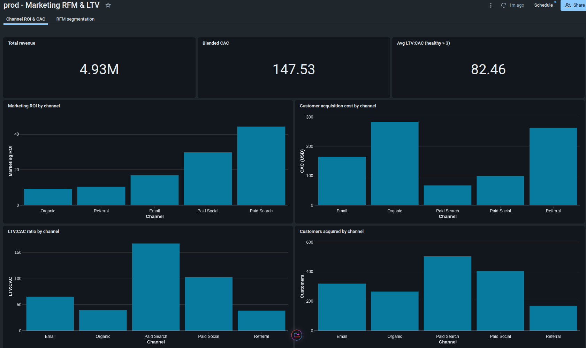
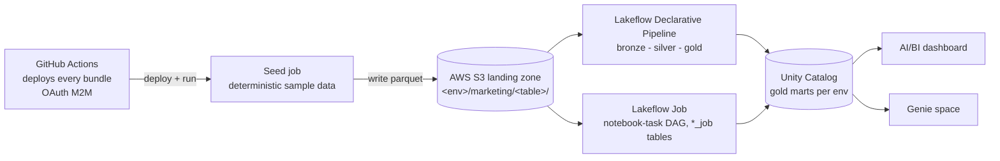
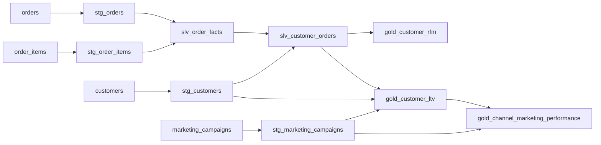
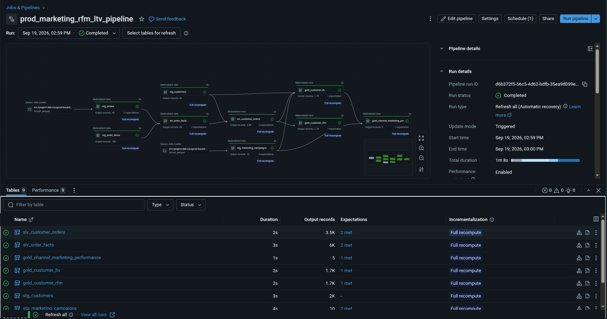
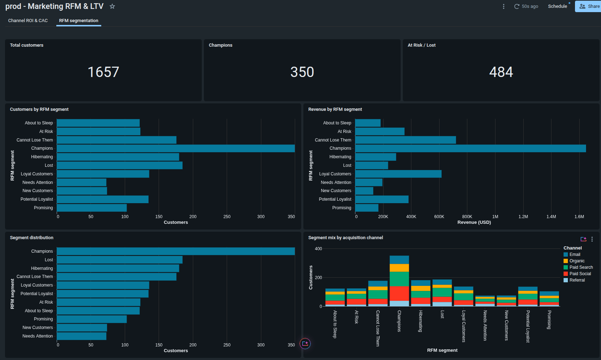
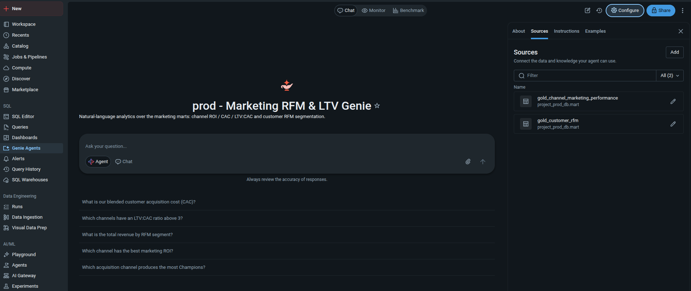
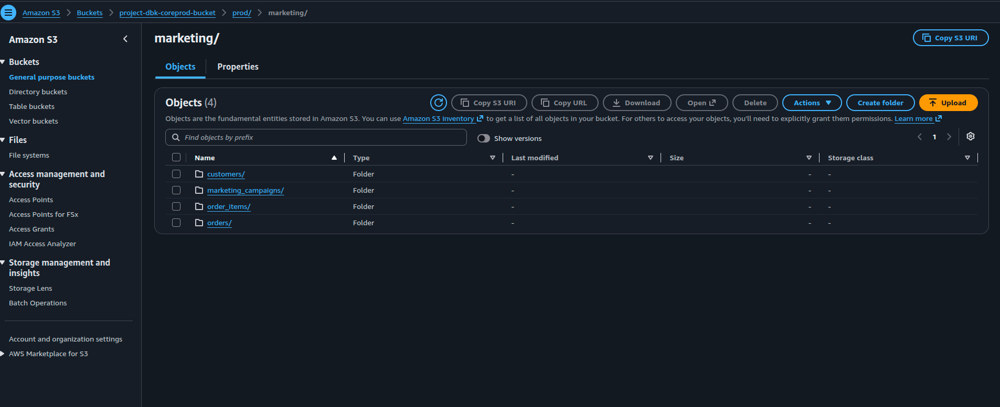
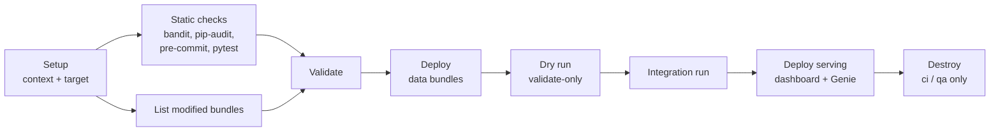

# Marketing RFM & LTV on Databricks (AWS) — Asset Bundles


This is an end-to-end **marketing data product on Databricks + AWS**, shipped as **Databricks Asset Bundles** and deployed by **GitHub Actions**. Raw parquet in S3 flows through a Bronze/Silver/Gold medallion into three gold marts, which are served through an AI/BI dashboard and a Genie space.

The marts answer one business question: *where should the next marketing dollar go, and which customers should we spend it on?*

| Question | Gold mart |
|----------|-----------|
| Who should we target? | `gold_customer_rfm`: Recency / Frequency / Monetary scores plus a segment (Champions, At Risk, Lost…) |
| How much can we spend to acquire a customer? | `gold_customer_ltv`: historical and predictive CLV, CAC, LTV:CAC |
| Which channels deserve budget? | `gold_channel_marketing_performance`: revenue, CAC, ROI, LTV:CAC and CTR per channel |


<p align="center"><em>The <code>prod</code> dashboard: revenue, blended CAC, LTV:CAC and ROI per acquisition channel.</em></p>

### Highlights

- **One data product, two orchestrations.** The same medallion is built as a **Lakeflow Declarative Pipeline** and as a **Lakeflow Job** (notebook-task DAG), so you can compare the two side by side.
- **Serving layer included.** An AI/BI (Lakeview) dashboard and a Genie space read the gold marts, deployed declaratively like everything else.
- **Everything as code.** Pipelines, jobs, dashboards, Genie spaces and permissions all live in bundle YAML. Nothing is click-configured.
- **Self-contained environments.** A deterministic generator seeds identical sample data into every target (`dev`, `ci`, `qa`, `prod`), so each environment runs without shared state.
- **Data quality built in.** Every model declares expectations on its keys, and the pipeline's event log records how many rows passed or failed each one. Unit tests check that the DLT and job RFM logic stay identical.
- **Diff-aware CI/CD.** GitHub Actions validates, deploys, dry-runs, integration-tests and tears down **only the bundles a change touches**, authenticated with an OAuth M2M service principal.

---

## Table of Contents

1. [Architecture](#architecture)
2. [What Gets Deployed](#what-gets-deployed)
3. [Repository Layout](#repository-layout)
4. [How It Works](#how-it-works)
5. [Getting Started](#getting-started)
6. [CI/CD](#cicd)
7. [Daily Operations](#daily-operations)
8. [Data Quality and Security](#data-quality-and-security)
9. [Tearing Down](#tearing-down)
10. [Documentation Index](#documentation-index)

---

## Architecture



The Databricks workspace itself (VPC, IAM, Unity Catalog metastore, catalogs, service principals) is provisioned by Terraform in a separate infrastructure repo. These bundles deploy into it.

### Model lineage



---

## What Gets Deployed

### `marketing_rfm_ltv_dlt` — Lakeflow Declarative Pipeline

| Resource | Details |
|----------|---------|
| Pipeline `<target>_marketing_rfm_ltv_pipeline` | Serverless, `current` channel. SQL models (`CREATE OR REFRESH MATERIALIZED VIEW`) plus Python models (`@dp.materialized_view`) for the RFM scoring and customer rollups |
| Job `<target>_marketing_rfm_ltv_seed_data` | Task 1 writes deterministic parquet to S3. Task 2 refreshes the pipeline, so one run builds everything from scratch |
| Bronze (`stg_*`) | Cast, rename and dedup only (latest record per key via `row_number()` over `ModifiedDate`) |
| Silver (`slv_*`) | `slv_order_facts` rolls line items up to order grain. `slv_customer_orders` keeps completed orders and adds acquisition attributes |
| Gold (`gold_*`) | RFM quintile scoring and segments, historical and predictive CLV, CAC, channel ROI |


<p align="center"><em>A completed <code>prod</code> run: S3 sources through bronze, silver and gold, with row counts and expectations per table.</em></p>

### `marketing_rfm_ltv_job` — Lakeflow Job

| Resource | Details |
|----------|---------|
| Job `<target>_marketing_rfm_ltv_job` | Serverless notebook tasks wired with `depends_on`: `seed_sample_data` → 4 bronze → 2 silver → 3 gold |
| Tables | The same models as the pipeline, suffixed `_job`, so both implementations can share one schema |

### `marketing_rfm_ltv_dashboard` — serving layer

| Resource | Details |
|----------|---------|
| AI/BI dashboard | Two pages: **Channel ROI & CAC** and **RFM segmentation**. Queries run with each viewer's own credentials (`embed_credentials: false`) |
| Genie space | Natural-language Q&A over both marts, with sample questions, instructions and example SQL. Deployed to `dev` and `prod` only (see [CI/CD](#cicd)) |


<p align="center"><em>The RFM segmentation page: customers and revenue per segment, and segment mix by acquisition channel.</em></p>


<p align="center"><em>The Genie space over both gold marts, with its sample questions.</em></p>

Deploying the dashboard bundle requires the **direct** deployment engine (`bundle.engine: direct`), because `genie_spaces` is only supported there.

### Per-target resolution

| Target | Catalog | Schemas | Mode |
|--------|---------|---------|------|
| `dev` | `project_dev_db` | your personal `dev_<first>_<last>` schema (`BUNDLE_VAR_dev_schema_name`) | development |
| `ci` | `project_dev_db` | `staging` / `intermediate` / `mart` | development |
| `qa` | `project_qa_db` | `staging` / `intermediate` / `mart` | production |
| `prod` | `project_prod_db` | `staging` / `intermediate` / `mart` | production |

---

## Repository Layout

```
databricks_aws_dabs/
├── bundles/                              # One folder per bundle
│   ├── shared/                           #   Variables included by every bundle + shared_utils (importable by DLT Python)
│   ├── marketing_rfm_ltv_dlt/            #   Lakeflow Declarative Pipeline + seed job
│   │   ├── databricks.yml                #     Bundle config (includes ../shared/*.yml)
│   │   ├── targets.yml                   #     dev / ci / qa / prod
│   │   ├── variables.yml                 #     S3 source path, CLV assumptions
│   │   ├── resources/                    #     dlt_pipeline.yml, seed_data_job.yml
│   │   └── src/                          #     bronze/ silver/ gold/ (+ _setup/ sample-data generator)
│   ├── marketing_rfm_ltv_job/            #   Same medallion as a notebook-task Lakeflow Job
│   └── marketing_rfm_ltv_dashboard/      #   AI/BI dashboard + Genie space
│
├── scripts/                              # Diff-aware deploy / run / destroy / validate (see scripts/README.md)
│   ├── ci/                               #   CI helpers (bundle listing, serving-table bootstrap)
│   └── helpers/                          #   Bundle discovery
├── tests/                                # pytest: RFM segment ladder + DLT/Job parity (no Spark needed)
├── feature-docs/                         # Case design notes (business case, data model, methodology)
├── images/                               # README screenshots
├── typings/                              # Type stubs for dlt and Databricks notebook builtins
├── .github/workflows/ci.yml              # The whole CI/CD pipeline
├── .github/actions/databricks-ci-setup/  # Shared setup: uv, pinned Databricks CLI, target-branch fetch
├── .bundlerunignore                      # Resources CI never runs directly
├── .pre-commit-config.yaml               # Ruff, SQLFluff, Pylint (databricks-labs), codespell, basedpyright
├── .sqlfluff                             # SQL style (databricks dialect)
└── pyproject.toml / uv.lock              # Python 3.12 toolchain, managed by uv
```

---

## How It Works

### 1. Shared variables, per-target values

Every bundle includes `../shared/*.yml`, so catalogs, schemas, groups and the CI service principal are defined once. Each bundle's `targets.yml` maps these onto a target (see [Per-target resolution](#per-target-resolution)). Models never hardcode a catalog or schema. SQL reads `${catalog_name}.${bronze_schema_name}.stg_orders` from the pipeline `configuration`.

### 2. Deterministic sample data

[`generate_marketing_data.py`](bundles/marketing_rfm_ltv_dlt/src/_setup/generate_marketing_data.py) produces `customers`, `orders`, `order_items` and `marketing_campaigns` from a fixed `--seed` and `--as-of` date. Every target therefore lands **identical** parquet under `<marketing_source_path>/<target>/marketing/`, and test results can be reproduced. S3 credentials come from the `aws_scope_s3` secret scope.


<p align="center"><em>The <code>prod</code> landing zone in S3: one folder per source table.</em></p>

### 3. Business assumptions as parameters

Predictive CLV = AOV × annual order frequency × `clv_expected_lifespan_years` × `clv_gross_margin`. Both assumptions are bundle variables (defaults `3` years and `0.30`), so you can tune them per environment without touching SQL.

### 4. One RFM ladder, two implementations

The segment ladder (Champions → Loyal Customers → … → Lost) is canonical in [`rfm_segments.py`](bundles/marketing_rfm_ltv_dlt/src/gold/rfm_segments.py) and copied into the job notebook. [`tests/test_marketing_rfm.py`](tests/test_marketing_rfm.py) parses both files and fails if they drift.

---

## Getting Started

### Prerequisites

| Tool | Version | Notes |
|------|---------|-------|
| Python | `3.12` | Pinned in `pyproject.toml` |
| [uv](https://docs.astral.sh/uv/getting-started/installation/) | latest | Manages the virtualenv and lockfile |
| [Databricks CLI](https://docs.databricks.com/aws/en/dev-tools/cli/install) | recent | Needs support for the `direct` engine (Genie spaces) |

You also need:

- A **Databricks workspace on AWS** with Unity Catalog, the `project_{dev,qa,prod}_db` catalogs, and a SQL warehouse.
- An **S3 bucket** behind a UC external location for the raw data, plus an `aws_scope_s3` secret scope holding `ACCESS_KEY_ID` / `SECRET_ACCESS_KEY`.

### Step 1 — Set up the toolchain

```bash
uv venv
uv sync --dev
uv run pre-commit install
cp .env.example .env      # set DATABRICKS_HOST and BUNDLE_VAR_dev_schema_name
set -a && source .env && set +a
databricks auth login --host "$DATABRICKS_HOST"
```

Point `workspace.host` in each bundle's `targets.yml` and `marketing_source_path` in `marketing_rfm_ltv_dlt/variables.yml` at your own workspace and bucket.

### Step 2 — Build the DLT implementation

```bash
cd bundles/marketing_rfm_ltv_dlt
databricks bundle deploy --target dev
databricks bundle run marketing_rfm_ltv_seed_data --target dev   # seeds S3, then refreshes the pipeline
```

### Step 3 — Build the Job implementation

```bash
cd ../marketing_rfm_ltv_job
databricks bundle deploy --target dev
databricks bundle run marketing_rfm_ltv_job --target dev         # first task seeds S3 itself
```

### Step 4 — Deploy the dashboard and Genie space

```bash
cd ../marketing_rfm_ltv_dashboard
databricks bundle deploy --target dev
```

The Genie space checks at creation time that its gold tables exist, so run Step 2 first. Open both from the workspace **Dashboards** and **Genie** lists.

> Want to inspect the data before deploying? Generate it locally:
> `uv run --with faker python bundles/marketing_rfm_ltv_dlt/src/_setup/generate_marketing_data.py --env dev --local-path ./_sample_data`

---

## CI/CD

One workflow, [`.github/workflows/ci.yml`](.github/workflows/ci.yml), handles every branch. It only acts on bundles whose `.yml`, `.py`, `.sql` or `.ipynb` files changed.

| Trigger | Checks | Deploys to | Dry run | Integration run | Teardown |
|---------|--------|------------|---------|-----------------|----------|
| PR → `dev` | security scan, pre-commit, unit tests, validate | `ci` | ✅ | — | ✅ |
| PR → `main` | same | `qa` | ✅ | ✅ | ✅ |
| Merge → `dev` | same | `ci` | — | ✅ | ✅ |
| Merge → `main` | same | `prod` | — | ✅ | — |

### Stages



- **Data bundles before serving bundles.** Bundles listed in `SERVING_BUNDLES` (the dashboard) deploy in their own stage, after the data bundles and their integration runs. If a target deploys a Genie space and its gold tables are missing, [`ensure_serving_tables.sh`](scripts/ci/ensure_serving_tables.sh) runs the seed job and waits for the tables first.
- **Genie only where tables persist.** `ci` and `qa` are destroyed after each run, which drops their pipeline tables, so they deploy the dashboard without a Genie space.
- **Seeding before dry runs.** A dry run resolves source paths, so any job tagged `ci_seed_task: <task_key>` runs that single task first.
- **`.bundlerunignore`.** Resources listed here are never run directly by CI. The pipeline is listed because the seed job refreshes it after seeding.

Authentication uses an OAuth M2M service principal. Set `DATABRICKS_HOST` as a repository **variable** and `DATABRICKS_CLIENT_ID` / `DATABRICKS_CLIENT_SECRET` as repository **secrets**. Script details are in [scripts/README.md](scripts/README.md) and [scripts/ci/README.md](scripts/ci/README.md).

---

## Daily Operations

| Task | Where |
|------|-------|
| Add or change a model | `bundles/marketing_rfm_ltv_dlt/src/<layer>/` (SQL by default, Python for complex logic), and mirror it in `marketing_rfm_ltv_job/src/<layer>/*_nb.py` |
| Change an RFM segment | `rfm_segments.py` **and** the job's `gold_customer_rfm_nb.py`. The parity test fails if you forget one |
| Tune CLV assumptions | `clv_gross_margin` / `clv_expected_lifespan_years` in `marketing_rfm_ltv_dlt/variables.yml`, or override per target |
| Edit the dashboard | Edit it in the UI, then `databricks bundle generate dashboard --existing-id <id>` to pull the `.lvdash.json` back (see the [bundle README](bundles/marketing_rfm_ltv_dashboard/README.md)) |
| Add a bundle | New folder under `bundles/` with `databricks.yml` including `../shared/*.yml`. CI picks it up automatically |
| Add a CI script | `git add --chmod=+x scripts/...`. This repo lives on a drive with `core.fileMode=false`, so a local `chmod` isn't recorded |

Typical flow: branch from `dev`, change a bundle, open a PR to `dev`, and let CI deploy it to `ci`. Then promote `dev` → `main` (`qa` + integration run), and merge to deploy to `prod`.

---

## Data Quality and Security

- **Expectations on keys.** Models drop rows with null keys (`ON VIOLATION DROP ROW` / `@dp.expect_or_drop`). `slv_customer_orders` fails the update on a missing customer (`@dp.expect_or_fail`), and `net_revenue >= 0` is tracked as a warning-only metric.
- **Strict medallion contract.** Bronze only casts, renames and dedups. Joins happen in silver, business logic in gold.
- **UC-governed serving.** The dashboard runs queries with the viewer's own credentials, so Unity Catalog grants apply to every chart.
- **Group-based permissions.** Bundles grant `CAN_MANAGE` / `CAN_VIEW` / `CAN_RUN` to groups and the CI service principal, never to individuals (except your own `dev` deployment).
- **No secrets in git.** S3 keys live in a Databricks secret scope, CI credentials in GitHub secrets, and local settings in a git-ignored `.env`.
- **Guardrails in CI.** `bandit` and `pip-audit` on every run. Pylint with the `databricks-labs` plugin flags Unity Catalog incompatibilities, `dbutils` misuse and PAT leaks.

---

## Tearing Down

Destroy the serving layer first, then the data bundles:

```bash
cd bundles/marketing_rfm_ltv_dashboard && databricks bundle destroy --target dev
cd ../marketing_rfm_ltv_job            && databricks bundle destroy --target dev
cd ../marketing_rfm_ltv_dlt            && databricks bundle destroy --target dev
```

Things to know before you run it:

- **Pipeline tables** are dropped along with the pipeline.
- **Job tables** (`*_job`) are written by notebooks, not managed by the bundle, so they **remain**. Drop them manually if needed.
- **S3 sample data** remains under `<marketing_source_path>/<target>/marketing/`. Seeding again overwrites it with identical files.

---

## Documentation Index

| Document | Contents |
|----------|----------|
| [feature-docs/marketing_rfm_ltv.md](feature-docs/marketing_rfm_ltv.md) | Business case, data model, RFM and CLV methodology |
| [bundles/marketing_rfm_ltv_dashboard/README.md](bundles/marketing_rfm_ltv_dashboard/README.md) | Dashboard and Genie space: deploy, per-target resolution, UI editing |
| [scripts/README.md](scripts/README.md) | Diff-aware deploy / run / destroy / validate scripts |
| [scripts/ci/README.md](scripts/ci/README.md) | CI step wrappers and helpers |

---

## References

- [Databricks Asset Bundles](https://docs.databricks.com/aws/en/dev-tools/bundles/)
- [Lakeflow Declarative Pipelines](https://docs.databricks.com/aws/en/dlt/)
- [Lakeflow Jobs](https://docs.databricks.com/aws/en/jobs/)
- [AI/BI dashboards](https://docs.databricks.com/aws/en/dashboards/)
- [AI/BI Genie spaces](https://docs.databricks.com/aws/en/genie/)
- [OAuth M2M authentication for service principals](https://docs.databricks.com/aws/en/dev-tools/auth/oauth-m2m)
