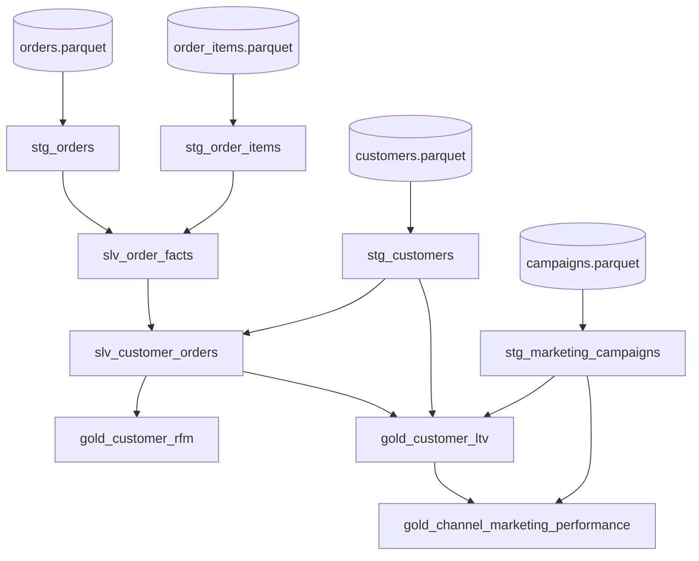

# Marketing Analytics Case — RFM Segmentation & Customer Lifetime Value

A reference data product that turns raw e-commerce events into three
marketing-actionable gold marts:

1. **`gold_customer_rfm`** — every customer scored on **R**ecency / **F**requency /
   **M**onetary value and bucketed into a segment (Champions, At Risk, Lost, …).
2. **`gold_customer_ltv`** — **historical** and **predictive Customer Lifetime
   Value**, plus **CAC** and the **LTV:CAC** unit-economics ratio.
3. **`gold_channel_marketing_performance`** — an acquisition-channel scorecard:
   revenue, CAC, **marketing ROI**, LTV:CAC and click-through rate.

The same case is delivered through **two implementations** to contrast Databricks'
orchestration options:

| | Bundle | Primitive |
|---|--------|-----------|
| A | [`bundles/marketing_rfm_ltv_dlt`](../bundles/marketing_rfm_ltv_dlt) | Lakeflow **Declarative Pipeline** (DLT) |
| B | [`bundles/marketing_rfm_ltv_job`](../bundles/marketing_rfm_ltv_job) | Lakeflow **Job** (notebook-task DAG) |

Design constraints (per the brief): **PySpark + SQL**, **batch only (no
streaming)**, **bronze lands in S3 as parquet**.

---

## 1. Business framing

> *"Where should the next marketing dollar go, and which customers should we
> spend it on?"*

Marketing teams need to (a) **target** the right customers (RFM), (b) decide how
much they can afford to **acquire** a customer (CLV vs CAC), and (c) **allocate
budget** across channels by return (ROI / LTV:CAC). These three questions map
cleanly onto the three gold marts above.

**Why it is a good data-engineering case:** it exercises the full medallion
(ingest → conform → aggregate), window functions (NTILE quintiles), dimensional
joins, parameterized business assumptions, and data-quality enforcement — while
the output is something a CMO would actually read.

---

## 2. Architecture

```
                 ┌──────────────────────────────────────────────────────────┐
   S3 LANDING    │  s3://<bucket>/<env>/marketing/<table>/                   │
   (parquet)     │   customers/  orders/  order_items/  marketing_campaigns/ │
                 └───────────────────────────┬──────────────────────────────┘
                                             │ batch read (read_files / spark.read.parquet)
                 ┌───────────────────────────▼──────────────────────────────┐
   BRONZE        │ stg_customers · stg_orders · stg_order_items ·            │
   (staging)     │ stg_marketing_campaigns        cast / rename / dedup only │
                 └───────────────────────────┬──────────────────────────────┘
                                             │
                 ┌───────────────────────────▼──────────────────────────────┐
   SILVER        │ slv_order_facts        (orders ⨝ items → order grain)     │
   (intermediate)│ slv_customer_orders    (completed orders ⨝ customers)     │
                 └───────────────────────────┬──────────────────────────────┘
                                             │
                 ┌───────────────────────────▼──────────────────────────────┐
   GOLD          │ gold_customer_rfm      gold_customer_ltv                  │
   (marts)       │                        gold_channel_marketing_performance │
                 └──────────────────────────────────────────────────────────┘
```

### Lineage (model dependency graph)



---

## 3. Data model

### Sources (raw parquet in S3)

| Table | Grain | Key columns |
|-------|-------|-------------|
| `customers` | 1 row / customer | `CustomerId`, `AcquisitionChannel`, `SignupDate` |
| `orders` | 1 row / order | `OrderId`, `CustomerId`, `OrderTimestamp`, `Status` |
| `order_items` | 1 row / order line | `OrderItemId`, `OrderId`, `Quantity`, `UnitPrice`, `Discount` |
| `marketing_campaigns` | 1 row / campaign | `CampaignId`, `Channel`, `Cost`, `Impressions`, `Clicks` |

### Medallion responsibilities

- **Bronze** — *cast / rename / dedup only.* Latest-record dedup via
  `row_number()` over `ModifiedDate`. No business logic. Keys validated.
- **Silver** — *conform & join.* `slv_order_facts` collapses line items to order
  grain and computes `net_revenue = Σ unit_price·qty·(1−discount)`.
  `slv_customer_orders` keeps **completed** orders and attaches the acquisition
  channel / signup date.
- **Gold** — *business logic & aggregation.* RFM scoring, CLV modeling, channel ROI.

---

## 4. Methodology

### 4.1 RFM (`gold_customer_rfm`)

Per customer, against a **snapshot date = max(order_date)** in the dataset (so
results are reproducible regardless of run time):

| Metric | Definition |
|--------|------------|
| Recency | `datediff(snapshot_date, last_order_date)` — *lower is better* |
| Frequency | `count(distinct order_id)` |
| Monetary | `sum(net_revenue)` |

Each metric is scored into **quintiles 1–5 (5 = best)** with `NTILE(5)`. Recency
is inverted (fewest days → score 5). The `(r,f,m)` scores feed a single,
**Spark-free** mapping function (`rfm_segments.py`) → segment label
(Champions, Loyal Customers, At Risk, Hibernating, Lost, …). That function is the
canonical logic and is **unit-tested** (`tests/test_marketing_rfm.py`).

### 4.2 Customer Lifetime Value (`gold_customer_ltv`)

| Output | Formula |
|--------|---------|
| Historical CLV | `Σ net_revenue` to date |
| AOV | `historical_clv / total_orders` |
| Annual frequency | `total_orders / (tenure_days / 365)` |
| **Predictive CLV** | `AOV × annual_frequency × expected_lifespan_years × gross_margin` |
| **CAC** | `channel_campaign_cost / customers_acquired_in_channel` |
| **LTV:CAC** | `predictive_clv / CAC` |

`gross_margin` (default **0.30**) and `expected_lifespan_years` (default **3**)
are **injected from config** (pipeline `configuration` / job parameters) so the
model is tunable per environment without code changes.

### 4.3 Channel performance (`gold_channel_marketing_performance`)

Aggregates CLV to acquisition channel and joins campaign spend/delivery:

`marketing_roi = (revenue − cost) / cost`, `ltv_to_cac_ratio = avg_predictive_clv / cac`,
`click_through_rate = clicks / impressions`. A **LTV:CAC > 3** is the classic
"healthy unit economics" benchmark — channels below it are over-paying for
acquisition.

---

## 5. Data quality

| Where | Rule |
|-------|------|
| Bronze keys | `EXPECT (id IS NOT NULL) ON VIOLATION DROP ROW` |
| `stg_marketing_campaigns` | `EXPECT (cost >= 0)` |
| `slv_order_facts` | `EXPECT (net_revenue >= 0)` |
| `gold_customer_rfm` | `EXPECT (customer_id IS NOT NULL) ON VIOLATION FAIL` |

In the DLT bundle these are native `CONSTRAINT … EXPECT` clauses (SQL) and
`@dp.expect*` decorators (Python). The job bundle enforces the equivalent with
`filter()` / `WHERE` guards, since jobs have no native expectations.

---

## 6. The two implementations

| Aspect | DLT pipeline | Lakeflow Job |
|--------|--------------|--------------|
| Dependency graph | **Inferred** by DLT from references | **Declared** via `depends_on` |
| Materialization | `@dp.materialized_view` / `CREATE OR REFRESH MATERIALIZED VIEW` | `CREATE OR REPLACE TABLE` / `saveAsTable` |
| Data quality | Native `EXPECT` | `filter` / `WHERE` |
| Incremental/refresh | Managed by DLT | Manual (full refresh here) |
| Best when | Declarative ETL, lineage, quality-as-data | Mixed workloads, external steps, fine-grained control |

Both produce **identical tables and numbers** — the RFM ladder and CLV formulas
are kept in sync (the job's `assign_rfm_segment` mirrors the canonical
`rfm_segments.py`). This is the headline talking point: *one logical data product,
two orchestration idioms.*

---

## 7. Running it end to end

```bash
# 0. (optional) local smoke test of the generator — writes parquet locally
python bundles/marketing_rfm_ltv_dlt/src/_setup/generate_marketing_data.py \
    --env dev --local-path ./_sample_data

# 1. Land sample parquet in S3 (run as a Databricks notebook/job)
python bundles/marketing_rfm_ltv_dlt/src/_setup/generate_marketing_data.py \
    --env dev --num-customers 2000

# 2a. Pipeline implementation
cd bundles/marketing_rfm_ltv_dlt
databricks bundle validate --target dev
databricks bundle deploy   --target dev
databricks bundle run marketing_rfm_ltv_pipeline --target dev

# 2b. Job implementation
cd ../marketing_rfm_ltv_job
databricks bundle validate --target dev
databricks bundle deploy   --target dev
databricks bundle run marketing_rfm_ltv_job --target dev

# 3. Unit test for the RFM logic (no cluster needed)
uv run pytest tests/test_marketing_rfm.py
```

---

## 8. Interview talking points

- **Medallion discipline** — bronze does *only* cast/rename/dedup; business logic
  lives in gold. Easy to defend layer by layer.
- **Reproducibility** — recency anchored to the data's own snapshot date, not
  `current_date`, so reruns are deterministic.
- **Config over code** — CLV margin/lifespan are environment variables; the same
  artifact serves dev/qa/prod with different assumptions.
- **Testability** — the one piece of gnarly conditional logic (segment mapping)
  is pulled out Spark-free and unit-tested; the rest is declarative SQL/PySpark.
- **Quality as a first-class concern** — expectations on keys and revenue, with
  `DROP ROW` vs `FAIL` chosen per severity.
- **Right tool for the job** — a clear, honest comparison of when to reach for a
  declarative pipeline vs an imperative job DAG.

### Possible extensions (good "what would you do next?" answers)
- Add an **AI/BI dashboard** or **Genie space** on the three gold marts.
- Swap historical CLV for a **BG/NBD + Gamma-Gamma** probabilistic CLV model.
- Make bronze **incremental** with Auto Loader once near-real-time is required.
- Add **multi-touch attribution** to credit channels beyond first-touch.
```
